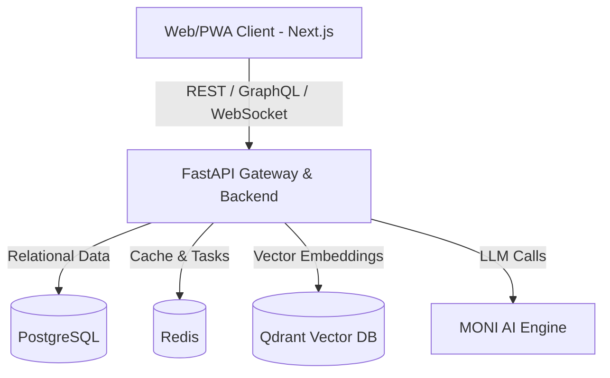

# MANITOR AI - System Architecture

## Overview
MANITOR AI is a comprehensive Personal Life Operating System designed for modularity, high performance, and AI-native capabilities.

## Architecture Diagram (Logical)

## Technology Stack
- **Frontend**: Next.js 15, React 19, TypeScript, Tailwind CSS v4, ShadCN UI
- **Backend**: FastAPI (Python)
- **Databases**: PostgreSQL (primary), Redis (cache/messaging), Qdrant (vectors)
- **Authentication**: Clerk

## Core Principles
1. **Modularity**: Each module (Reminders, Expenses, etc.) is isolated.
2. **Scalability**: Dockerized services.
3. **AI-First**: All data is accessible to the MONI AI engine via tool calling and RAG.
